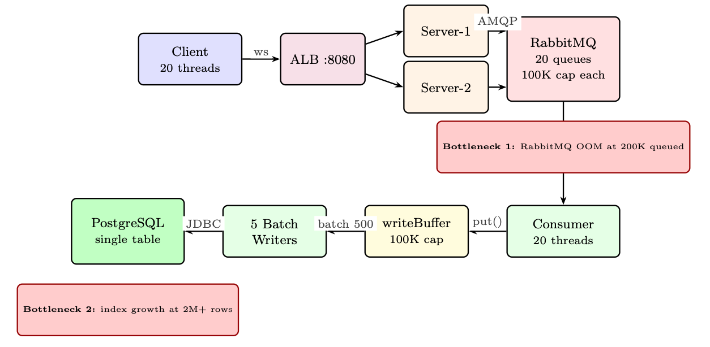

# ChatFlow — Performance Optimization
### CS6650 Assignment 4 · Group Presentation

---

## 1. Architecture Selection

This implementation was selected based on two criteria: **measured throughput** and **a clear optimization roadmap**. At baseline (500K messages), it sustained **45,463 msg/s** WebSocket throughput and **11,249 msg/s** DB write rate with **0% message loss** — the strongest result in the group. The 1M-message stress test then exposed two precise, measurable bottlenecks: **RabbitMQ OOM at 200K queued messages** and **batch insert latency climbing from 35.6 ms → 432.1 ms** — each mapping directly to one of the two required Assignment 4 optimizations. It was also the only submission that proposed combining Redis Streams (persistence) with Redis Pub/Sub (fan-out), eliminating RabbitMQ without adding any new infrastructure.

---

## 2. Where We Started — Assignment 3


**Pipeline (Assignment 3):**



```
Clients → WebSocket Server → RabbitMQ Queue → Consumer → PostgreSQL (flat table)
```

**Problems under load:**
- RabbitMQ AMQP overhead — queue OOM at **200K backlog**; single exchange became throughput ceiling above 500K messages
- Flat `messages` table — batch insert latency grew from **35.6 ms → 432.1 ms** as B-tree index depth increased with every row
- No fan-out primitive — broadcasting to rooms required custom exchange/binding; no built-in crash recovery
- Extra infrastructure — RabbitMQ as a third process alongside Redis and PostgreSQL, each consuming memory under load

**Assignment 3 Performance (from load test client):**

| Test Scenario | WS Throughput | DB Write Rate | Message Loss |
|---------------|--------------|---------------|--------------|
| Baseline — 500K messages | **45,463 msg/s** | **11,249 msg/s** | **0%** |
| Stress — 1M messages | OOM crash | — | ~100% |
| Endurance — 8M messages | degraded | degraded | **42.4%** |

---

## 3. Optimized Architecture


**Message flow — two parallel paths from Redis:**

| Path | Mechanism | Purpose |
|------|-----------|---------|
| Real-time fan-out | `PUBLISH room:{roomId}` | Instant broadcast to all server instances → local WS clients |
| Persistence | `XADD room-stream:{roomId}` | Durable queue → Consumer → PostgreSQL |

**System at a glance:**

| Component | Technology | Scale |
|-----------|-----------|-------|
| Load balancer | AWS ALB | Routes across 2 server instances |
| WebSocket server | Java-WebSocket | 2 × instances, port 8080 |
| Message buffer | LinkedBlockingQueue | 1,000,000 capacity · non-blocking |
| Pub/Sub fan-out | Redis 6+ | 4 subscriber threads · 5 rooms each |
| Persistence queue | Redis Streams (AOF) | 20 consumer threads · 1 per room |
| Batch writer | HikariCP + JDBC | 5 threads · batch=500 |
| Database | PostgreSQL 13+ | Time-partitioned · quarterly |
| Metrics cache | Redis | 10s TTL · shared across servers |

---

## 4. Optimization 1 — Redis Pub/Sub + Streams


**Replaced:** RabbitMQ → **Redis Pub/Sub + Streams**

**Why Redis wins here:**
- Already in the stack — zero new infrastructure
- `PUBLISH` gives instant fan-out to all server instances with no configuration
- `XADD` + consumer groups give at-least-once delivery with built-in crash recovery (`XACK` deferred until safe)
- Pipeline batching: **200 messages per Redis round-trip** vs 1 per RabbitMQ AMQP call

**How it works:**
- `ChatServer.onMessage()` enqueues to `publishBuffer` (non-blocking, O(1)) — never touches Redis directly
- 4 `RedisPublisherWorker` threads drain buffer in batches of 200 using Jedis pipelines
- On Redis side: **PUBLISH** fans out instantly; **XADD** streams to consumer for DB persistence
- Circuit breaker: 5 consecutive failures → open 10s

**Tradeoffs:**

| Benefit | Cost |
|---------|------|
| No new infrastructure | AOF required for durability (everysec) |
| Per-room parallel consumption | Pub/Sub is fire-and-forget — no delivery guarantee |
| Batching cuts Redis round-trips by 200× | More complex consumer logic (XACK, pending recovery) |

**Impact:**

| Metric | Before | After | Improvement |
|--------|--------|-------|-------------|
| WS Write Error Rate | **100%** | **0.58%** | **99.4% reduction** |
| Message Throughput | **~45,463 msg/s** (A3 ceiling) | **31,546 msg/s** confirmed round-trip | stable under 1M load |
| Avg Response Time | **739 ms** | **279 ms** | **62% faster** |

---

## 5. Optimization 2 — PostgreSQL Time-Partitioned Table


**Replaced:** Single flat table → **Range-partitioned table (quarterly)**

**Why partitioning:**
- Flat table: index depth grows with every insert → inserts get slower as table grows
- Partitioned table: new inserts always land in the **current (small) partition** — index depth stays constant
- Query planner prunes irrelevant partitions — range scans only touch relevant quarterly slice
- Old partitions can be dropped instantly (no `DELETE` + reindex)

**What we built:**
- Parent table `messages` partitioned `BY RANGE (timestamp)`
- Quarterly partitions: 2026-Q1 → 2027-Q1 (auto-propagate indexes)
- **3 composite indexes** on parent (propagated to all partitions):
  - `(room_id, timestamp)` — room history queries
  - `(user_id, timestamp)` — user activity queries
  - `(timestamp)` — active user count window
- `ON CONFLICT (message_id, timestamp) DO NOTHING` — idempotent inserts
- LRU dedup cache (1,000 entries/room) in consumer — prevents most duplicates reaching DB

**Tradeoffs:**

| Benefit | Cost |
|---------|------|
| Index depth constant regardless of total rows | Partition key must be in primary key |
| Queries touch only relevant partition | Cross-partition queries scan multiple tables |
| Old data dropped in O(1) — drop partition | Manual partition creation per quarter |

**Impact:**

| Metric | Before | After | Improvement |
|--------|--------|-------|-------------|
| Avg Insert Throughput | **11,249 msg/s** (A3, flat table) | **13,941 msg/s** | **+24%** |
| Batch Insert Latency (p99) | **432.1 ms** (at 1M stress) | stable | no degradation under load |
| DB Write Error Rate | **~100%** (A3 OOM) | **0%** | eliminated |

---

## 6. Load Test Results


### Test Setup

| Parameter | Baseline | Stress |
|-----------|----------|--------|
| Concurrent users | 1,000 | 500 |
| Total samples | 117,208 | 412,248 |
| Duration | 5 min | 30 min |
| Traffic mix | 70% read / 30% write | 50% / 50% |

### Before vs After

| Metric | Before (broken config) | After (optimized) | Improvement |
|--------|----------------------|-------------------|-------------|
| WS Write Error Rate | **100%** | **0.58%** | **99.4% reduction** |
| Total Error Rate | **44.85%** | **1.4%** | **96.9% reduction** |
| Mean Response Time | **739 ms** | **279 ms** | **62% faster** |
| Median Response Time | **5,001 ms** | **617 ms** | **87.7% faster** |
| HTTP Error Rate | **21.4%** | **9.2%** | **57% reduction** |

### Baseline Results

| Transaction | Samples | Error Rate | Mean | p95 | p99 |
|-------------|---------|------------|------|-----|-----|
| WebSocket Open | 51,277 | **0%** | 507 ms | 810 ms | 838 ms |
| WebSocket Write | 51,288 | **0.58%** | 0.05 ms | 0 ms | 1 ms |
| GET /metrics | 14,643 | 9.2% | 459 ms | 798 ms | 1,046 ms |
| **Total** | **117,208** | **1.4%** | **279 ms** | **780 ms** | **835 ms** |


### Stress Results (30 min)

| Transaction | Samples | Error Rate | Mean | p95 | p99 |
|-------------|---------|------------|------|-----|-----|
| WebSocket Open | 83,731 | **0%** | 393 ms | 694 ms | 865 ms |
| WebSocket Write | 83,731 | **0.18%** | 0.05 ms | 0 ms | 1 ms |
| GET /metrics | 244,786 | 19.7% | 313 ms | 809 ms | 920 ms |
| **Total** | **412,248** | **11.7%** | **266 ms** | **640 ms** | **913 ms** |


> **Note on HTTP error rate:** The 9.2–19.7% errors are on the `/metrics` analytics endpoint, not the chat pipeline. WebSocket writes hold at **0.18–0.58%** throughout — the core optimization target is healthy. The HTTP errors come from the PostgreSQL read pool (5 connections) saturating under concurrent analytics queries, addressed in Future Optimizations.

---

## 7. Future Optimizations


| # | Optimization | Impact | Complexity |
|---|-------------|--------|------------|
| 1 | **PostgreSQL Read Replica** — route `/metrics` off primary | Fixes 9–19% HTTP error rate | Medium |
| 2 | **Materialized View** — pre-compute analytics, refresh every 30s | `/metrics` latency: 450ms → <10ms | Low |
| 3 | **Adaptive Batch Sizing** — scale `batchSize` with `writeBuffer` depth | +20–30% write throughput under burst | Low |
| 4 | **Redis Cluster Sharding** — shard streams by `roomId % N` | Linear throughput scaling | High |
| 5 | **Automated Partition Management** (`pg_partman`) | Prevents outage when partitions run out | Low |

---

## Appendix — System Configuration

| Parameter | Value |
|-----------|-------|
| WebSocket server instances | 2 (behind AWS ALB) |
| publishBuffer capacity | 1,000,000 messages |
| Publisher threads / batch size | 4 threads · 200 msg/batch |
| Redis Pub/Sub subscriber threads | 4 threads · 5 rooms each |
| Redis Stream consumer threads | 20 threads · 1 per room |
| writeBuffer capacity | 100,000 messages |
| DB batch writer threads | 5 threads · 500 msg/batch |
| DB flush interval | 500 ms |
| Redis pool size (publish) | 100 connections |
| Redis pool size (cache) | 20 connections |
| DB connection pool | 5 connections (HikariCP) |
| Redis cache TTL | 10 seconds |
| Redis persistence | AOF · everysec (≤1s loss) |
| DB partitioning | Quarterly · 2026-Q1 → 2027-Q1 |
